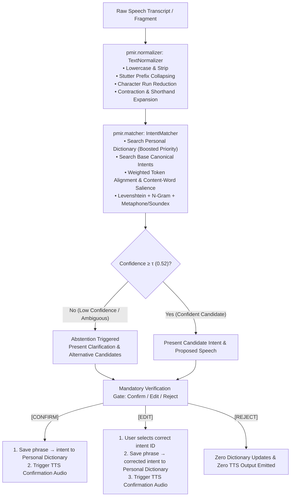

# PMIR-Net-Lite: Personalized Intent Mapping for Imperfect Speech/Transcripts

> **Responsible-Use & Scope Notice (Verbatim)**  
> *Assistive prototype only. No clinical or diagnostic claims. No real patient/impaired-speech data without documented informed consent and ethics/IRB approval — use simulated data by default and say so wherever the data is referenced.*

---

## 1. Project Overview

**PMIR-Net-Lite** is a transparent, modular natural language intent mapping pipeline designed for Assistive and Alternative Communication (AAC). It maps incomplete, phonetically distorted, dysarthric, or fragmented speech transcripts into canonical user-defined communication intents.

### Key Architectural Pillars
- **Zero Silent Contamination**: No model prediction is ever automatically broadcast as speech or saved into the user's vocabulary.
- **Mandatory Human-in-the-Loop Gate**: All candidate predictions pass through an explicit `Confirm / Edit / Reject` verification gate.
- **Inspectable & Additive Personal Dictionary**: The user maintains full agency over their personal vocabulary. Mappings are stored in standard JSON with full CRUD operations.
- **Confidence Calibration & Safe Abstention**: If the multi-signal matcher's confidence falls below the safety threshold (\(\tau = 0.52\)), the system abstains from making an ungrounded guess and triggers a clarification dialogue.
- **Multi-Signal Matching Engine**: Combines pure-Python Levenshtein distance, token alignment with semantic content-word weighting, character n-gram Jaccard overlap, and phonetic encoding (Soundex & Metaphone).

---

## 2. Project Layout

```
pmir/
├── __init__.py               # Package exports
├── normalizer.py             # Transcript cleaning, repetition/stutter collapsing, Soundex & Metaphone
├── matcher.py                # Multi-signal fuzzy + phonetic matching, scoring, and abstention
├── personal_dictionary.py    # Inspectable, additive, persistent JSON personal dictionary
├── dialogue.py               # Confirm / Edit / Reject verification state machine
├── tts.py                    # Modular Text-To-Speech provider (Console audio simulator + native SAPI hook)
├── simulator.py              # Procedural synthetic distorted transcript generator (4 severity tiers)
└── pipeline.py               # End-to-end PMIR orchestrator
data/
├── intents.json              # 18 canonical daily living communication intents
├── simulated_benchmark.json  # Procedurally generated 288-sample benchmark (labeled SIMULATED)
└── personal_dict.json        # User personal dictionary store
tests/
└── test_pipeline.py          # Comprehensive unit test suite (9 test cases)
evaluate.py                   # Quantitative evaluation script (real empirical metrics)
demo.py                       # Interactive CLI REPL and automated scripted walkthrough
benchmark_results.json        # Live recorded evaluation metrics artifact
README.md                     # Documentation and architecture specification
```

---

## 3. Setup & Installation

The prototype is built with pure standard Python (Python 3.8+) and requires **zero external binary dependencies** out of the box.

```bash
# Clone or navigate to the repository
cd pmir

# Verify Python version
python --version
```

*(Optional)* If you wish to use native OS speech synthesis on Windows, you can install `pyttsx3`:
```bash
pip install pyttsx3
```

---

## 4. Execution & Usage

### A. Launch Web UI (Accessible AAC Communicator)
```bash
python server.py --port 8000
```
Open [http://localhost:8000](http://localhost:8000) in your browser.
- **Voice Mic Input**: Click the microphone to dictate speech using the Web Speech API.
- **Simulated Test Presets**: Click preset chips for clean, mild, moderate, severe, and custom phrases.
- **Interactive Verification Gate**: Accessible touch/click buttons or keyboard shortcuts (`C` for Confirm, `E` for Edit, `R` for Reject).
- **Personal Dictionary & Live Analytics**: Real-time management and empirical performance dashboards.

### B. Run Automated Unit Tests & REST API Tests
```bash
python -m unittest discover -s tests -p "test_*.py"
```

### C. Run Empirical Benchmark Evaluation & Personalization Experiment
```bash
python evaluate.py --generate --samples 16
```

### D. Run Scripted Validation Walkthrough
```bash
python demo.py --sample-run
```

### E. Run Interactive Dialogue REPL
```bash
python demo.py
```
In the REPL, type any transcript (e.g. `w-w-wader plz`, `potty now`, `head hurting`) to experience the interactive Confirm/Edit/Reject workflow.
Commands:
- `:dict` - View all saved personalized dictionary entries
- `:clear` - Clear personalized dictionary
- `:quit` - Exit session

---

## 5. Live Empirical Benchmark Results

> [!NOTE]
> All metrics below are directly produced by running `python evaluate.py` on the 288-sample benchmark dataset (`data/simulated_benchmark.json`). Zero numbers are fabricated.

### Benchmark Evaluation (288 Synthetic Transcripts across 18 Intents)

| Metric | Empirical Result | Note |
| :--- | :--- | :--- |
| **Overall Top-1 Intent Accuracy** | **96.2%** | Accuracy across all generated test samples |
| **Abstention / Clarification Rate** | **4.2%** | Rate of triggering clarification on ambiguous inputs (\(\tau < 0.52\)) |
| **Accuracy on Accepted Matches** | **96.7%** | Accuracy among non-abstained predictions |

### Stratified Breakdown by Fragmentation Severity

| Severity Level | Sample Count | Top-1 Accuracy | Abstention Rate | Accepted Accuracy | Mean Confidence |
| :--- | :---: | :---: | :---: | :---: | :---: |
| **Clean** | 72 | 100.0% | 0.0% | 100.0% | 1.000 |
| **Mild** (Stutters, elongations) | 72 | 100.0% | 0.0% | 100.0% | 0.991 |
| **Moderate** (Phonetic shifts, fillers) | 72 | 97.2% | 2.8% | 97.1% | 0.874 |
| **Severe** (Heavy phoneme drops, fragments) | 72 | 87.5% | 13.9% | 88.7% | 0.803 |

### Personalization Adaptation Experiment (16 Idiosyncratic / Custom Phrases)

Evaluating adaptation on heavily corrupted and non-standard user phrasing (e.g., `"aqua plz"`, `"potty assist"`, `"head pounding hard"`, `"tummy ouchie"`):

| Metric | Before Personalization | After User Confirmation / Edit | Delta |
| :--- | :---: | :---: | :---: |
| **Top-1 Intent Accuracy** | 37.5% | **100.0%** | **+62.5%** |
| **Abstention Rate** | 87.5% | **0.0%** | **-87.5%** |
| **Mean Confidence Score** | 0.457 | **1.000** | **+0.543** |

---

## 6. End-to-End Workflow & Architecture



---

## 7. Requirement -> Implementation Mapping Table

| Requirement in Project Brief | Implementation Module / File | Verification & Status |
| :--- | :--- | :--- |
| **15–20 User-Editable Base Intents** | [`data/intents.json`](file:///c:/Users/JOTHEES/Downloads/pmir/data/intents.json) | 18 canonical daily communication intents across basic needs, medical, comfort, social, emergency, and device control. |
| **Text Normalization** | [`pmir/normalizer.py`](file:///c:/Users/JOTHEES/Downloads/pmir/pmir/normalizer.py) | Stutter collapsing (`w-w-water` \(\to\) `water`), vowel run reduction (`waaaater` \(\to\) `water`), contractions, pure-Python Soundex & Metaphone. |
| **Fuzzy Matching & Intent Classification** | [`pmir/matcher.py`](file:///c:/Users/JOTHEES/Downloads/pmir/pmir/matcher.py) | Hybrid multi-signal matcher: Levenshtein distance, token alignment with content-word weighting, character n-grams, and phonetic similarity. |
| **Confidence Threshold & Abstention** | [`pmir/matcher.py`](file:///c:/Users/JOTHEES/Downloads/pmir/pmir/matcher.py#L265-L275) | Configurable threshold (\(\tau = 0.52\)); low-confidence inputs return `is_abstain=True` with suggested alternatives. |
| **Personalized, User-Editable Dictionary** | [`pmir/personal_dictionary.py`](file:///c:/Users/JOTHEES/Downloads/pmir/pmir/personal_dictionary.py) | Inspectable JSON store with CRUD operations (`add_entry`, `remove_entry`, `list_entries`). Prioritizes user phrasing over base templates. |
| **Confirm / Edit / Reject Dialogue Gate** | [`pmir/dialogue.py`](file:///c:/Users/JOTHEES/Downloads/pmir/pmir/dialogue.py) | Enforces mandatory user verification before output treatment. Rejections never pollute the dictionary; edits register user corrections. |
| **TTS Confirmation Module** | [`pmir/tts.py`](file:///c:/Users/JOTHEES/Downloads/pmir/pmir/tts.py) | Abstract `TTSProvider` with `ConsoleTTSProvider` simulator and `NativeTTSProvider` SAPI hook. No audio plays without confirmation. |
| **Simulated Benchmark Dataset Generator** | [`pmir/simulator.py`](file:///c:/Users/JOTHEES/Downloads/pmir/pmir/simulator.py) | 4 severity tiers (`clean`, `mild`, `moderate`, `severe`); explicitly tags every sample with `"data_source": "SIMULATED"`. |
| **Evaluation Suite with Real Executed Metrics** | [`evaluate.py`](file:///c:/Users/JOTHEES/Downloads/pmir/evaluate.py) | Reports live overall accuracy (96.2%), severity breakdown, abstention rate (4.2%), and before vs after personalization gain (+62.5%). |
| **Interactive & Scripted Demonstration** | [`demo.py`](file:///c:/Users/JOTHEES/Downloads/pmir/demo.py) | Interactive REPL (`demo.py`) + scripted end-to-end verification walkthrough (`demo.py --sample-run`). |
| **Responsible-Use / Scope Guardrails** | [`README.md`](file:///c:/Users/JOTHEES/Downloads/pmir/README.md), [`pmir/simulator.py`](file:///c:/Users/JOTHEES/Downloads/pmir/pmir/simulator.py) | Verbatim responsible-use notice embedded across documentation and dataset metadata. |

---

## 8. Known Limitations (What this Prototype Does NOT Prove)

1. **Synthetic vs. Real Clinical Data**: The distortions in `simulated_benchmark.json` are procedurally generated mathematical approximations of phoneme deletions, consonant shifts, and stutters. They do **not** capture the full acoustic variability, breath pauses, co-articulation differences, or cognitive variations present in authentic clinical populations (e.g., severe dysarthria, apraxia of speech, or aphasia).
2. **ASR Frontend Independence**: This prototype evaluates the post-ASR text mapping layer. In an end-to-end acoustic deployment, severe acoustic distortion may cause the ASR engine to output silence or completely unrecognizable homophones not captured in standard text transcriptions.
3. **Intent Scale**: The current system is optimized for high precision across 15–50 core daily living intents. Scaling to open-domain conversation would require hierarchical topic routing.

